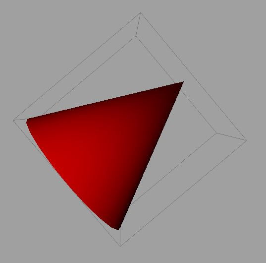

.. _index:

Oriented Bounding Boxes in Maya (OBB)
======================================
A simple python class that is based off code from `here <http://jamesgregson.blogspot.com/2011/03/latex-test.html>`_.

Features
=========
- 3 different solve methods (from points, triangles, and hull).
- Has a matrix attribute that can be applied to any transform in Maya (deformers, meshes, etc...).

Planned Features
================
- Translate, rotate, and scale attributes.
- Increase speed by making it a C++ plugin. 

Requirements
=============
- Autodesk Maya 2015 (http://www.autodesk.com/products/maya/overview)
- Scipy 0.16.0 (https://www.scipy.org/)
- Numpy 1.9.2 (http://www.numpy.org/)

Table of Contents
=================

.. toctree::
   :maxdepth: 2

   usage
   api
